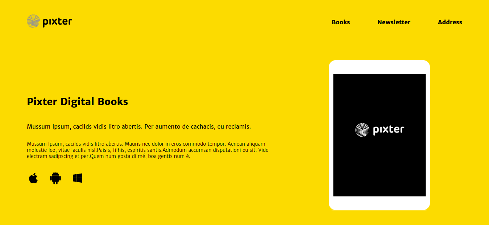
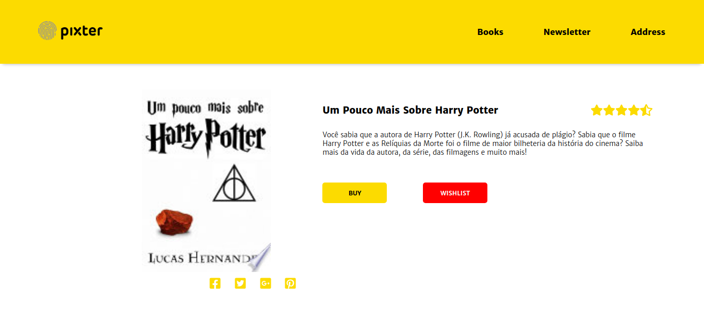

# [pixter-books](https://gusta-pixter-books.netlify.app)

  

 

  
  &emsp;
  

 

Este repositório contém os códigos-fonte para a versão web do projeto [pixter-books](https://gusta-pixter-books.netlify.app), um site que permite listar livros da base de dados do Google num aplicativo que simula a listagem dos mesmos.

## Desenvolvimento

  

 

O projeto `pixter-books` foi feito em React e desenvolvido em TypeScript.

Entre as principais bibliotecas usadas para o desenvolvimento, estão:

- `styled-components`, para a estilização geral de componentes;
- `react-router` e `react-router-dom`, para a construção e manipulação de rotas;
- `redux`, `react-redux` e `redux-saga`, para a manipulação de estados do aplicativo e busca de dados de forma assíncrona na API do Google;
- `react-icons`, para a inserção de ícones.

## Principais características

- Veja os livros listados pela API do Google;
- Acesse as informações de livros específicos.

## Como executar

Para executar esse projeto em modo de desenvolvimento, você precisa ter pelo menos um gerenciador de pacotes Node instalado em sua máquina. Os dois mais comuns são o `npm` e o `yarn`.

Logo após, basta clonar este repositório, criando uma cópia local dele na sua máquina, usando o Git.

Com o projeto em sua máquina, o abra em seu editor de preferência e execute o comando `npm install` ou `yarn` para instalar todas as dependências necessárias.

Por fim, execute o comando `npm start` ou `yarn start` na raiz do projeto e este irá abrir uma janela no navegador `http://localhost:3000`.

Pronto, você agora tem acesso a versão de desenvolvimento desse projeto, basta alterar os scripts em seu editor e veja a mudança acontecer no navegador. Divirta-se!

Caso esse processo não tenha funcionado, abra uma _issue_ neste projeto detalhando o que aconteceu.

## Como contribuir

Para contribuir com esse projeto, basta seguir os passos abaixo:

1. Faça um fork desse repositório em sua conta pessoal no Github;
2. Crie uma branch de `feature/nome-da-feature` em seu repositório;
3. Faça commits e encha essa branch criada com bastante conteúdo;
4. Faça um pull request da sua branch para este repositório;
5. Acompanhe a avaliação do pull-request e responda se necessário.

## Tarefas futuras

- **Melhor filtragem:** a filtragem atual permite a filtragem, mas não de forma otimizada;
- **Mais testes:** a aplicação possui um número considerável de componentes e o número atual de testes não cobre todas as ações;
- **Melhor deploy:** o deploy atualmente é feito de forma automática pelo Netlify quando um _pull request_ é feito para a branch `master`. Esse deploy automático pode ser melhorado com uma Github Action que rode os testes antes de subir uma nova versão, por exemplo, além de outras verificações que forem necessárias;

## Autores

- **Gustavo Andrade (@gustaandrade)**: Desenvolvedor Full Stack e Desenvolvedor de Jogos - [Portfólio](https://gustavoandrade.design)

## Licença

[MIT](./LICENSE)

   Made with :purple_heart:

